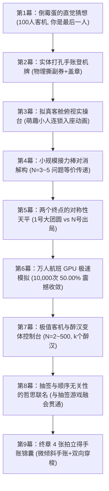

# 《飞机座位错配 V2》系统级设计规范与九幕心流蓝图

> **文件定位**：本文件是《飞机座位错配问题（Airplane Seating Problem）》V2 升级重构的**永久基准蓝图与设计规范**。后续所有代码编写、视觉样式、数学推导与动效打磨必须 100% 严格对照本文档执行，按幕逐页推进，保证最高交付质量。

---

## 🎨 一、V2 实体手账设计系统标准 (Design System)

继承《数学游戏探索 V2》的家族式设计语言：**“实体手账纸质感” + “现代极简扁平化” + “拟真物理动效”**。

### 1. 配色规范 (Color Tokens)
```css
:root {
    /* 纸张背景与卡片底色 */
    --bg-color: #fdf9ee;           /* 温润微黄的复古素描纸画布 */
    --paper: #fffef9;              /* 高亮手账纸板卡片 */
    
    /* 墨水阶梯 */
    --ink: #2f2a25;                /* 暖调深棕黑墨（主要文字） */
    --muted-ink: #6e665e;          /* 柔和注解灰（次要说明） */
    --bold-black: #000000;         /* 绝对对比高亮纯黑（图表与核心结论） */
    
    /* 语义色盘 */
    --coral: #e96e56;              /* 珊瑚红（警示 / 失败 / 100号占座） */
    --sky: #5aabd9;                /* 晴空蓝（基础航班 / 正常入座） */
    --sky-deep: #3c8ec0;           /* 深蓝（主操作 / 导航焦点） */
    --sun: #f7c84b;                /* 黄金橙（SSR / 成功 / 1号大团圆） */
    --leaf: #79ad62;               /* 森林绿（成功入座 / 50% 理论基准线） */
    --purple: #9a6bc7;             /* 葡萄紫（接力棒传递 / 变体拓展） */
    
    /* 线条与实体硬投影 */
    --line: rgba(47, 42, 37, 0.85);        /* 2.5px 硬核实体描边 */
    --soft-line: rgba(47, 42, 37, 0.14);   /* 分割虚线 / 辅助网格 */
    --shadow: 5px 6px 0 rgba(47, 42, 37, 0.16); /* 默认无模糊硬投影 */
}
```

### 2. 实体物理质感与交互反馈
- **硬描边与硬投影**：所有卡片、登机牌、座椅、按钮采用 `2.5px solid var(--line)`；
- **微交互状态**：
  - 默认：`box-shadow: 5px 6px 0 rgba(47, 42, 37, 0.16);`
  - 悬浮 Hover：`transform: translate(-3px, -3px); box-shadow: 8px 9px 0 var(--line);`
  - 按下 Active：`transform: translate(1px, 1px); box-shadow: 2px 2px 0 var(--line);`
- **字体规范**：
  - 标题与大字标：`Noto Serif SC`（宋体/衬线体，书卷气）；
  - 正文与说明：`Noto Sans SC` + `system-ui`；
  - 数据、公式、座位号：`ui-monospace, Consolas, monospace`。

---

## 📐 二、九幕心流全景与叙事架构 (The 9-Act Narrative Arc)

拒绝生硬枯燥的代数公式堆砌，严格遵循**“倒霉蛋代入 ➔ 实体撕票 ➔ 现场客舱推演 ➔ 接力棒自然对消 ➔ 终点对称性顿悟 ➔ 万人GPU震撼 ➔ 极值控制台 ➔ 抽签哲学 ➔ 拍立得手账”**的渐进式教学心流：



---

## 🔍 三、各幕详细交互与技术规格清单

### 【第 1 幕】倒霉蛋的直觉猜想 (Intuitive Bet)
- **情境沉浸**：一架载客 100 人的波音客机，1 号乘客是个完全不看票的醉汉随意乱坐；其余 2~99 号乘客若发现自己座位空着就正常坐，若被占就随机选一个空位。
- **核心设问**：“你是全机最后一位（第 100 位）登机的乘客，你还能坐回自己原本座位的概率是多大？”
- **互动下注**：
  - 选项 A：极小（接近 1% 或 0%）——“前面 99 个人都在乱占，轮到我肯定被占了”；
  - 选项 B：刚好一半（50%）——“直觉告诉我可能有什么平衡”；
  - 选项 C：极高（接近 99%）——“大家都在尽量坐自己的座”。
- **锚定效果**：记录玩家选择，作为后续战报与反思的对比锚点。

---

### 【第 2 幕】实体打孔手账登机牌 (Physical Boarding Pass)
- **视觉呈现**：复古纸质航空登机牌（AIRLINE BOARDING PASS），带虚线齿孔、航班号 `FLIGHT MA-100`、登机口、舱位；
- **物理交互**：
  - 用户亲手点击 **“✂️ 撕下登机副券”**，伴随纸张撕裂平移动效；
  - 盖上鲜红印章：`SEAT NO. 100 · 倒霉蛋特等座`；
  - 打印打字机字符，正式开启登机流程。

---

### 【第 3 幕】拟真客舱俯视实操台 (Interactive Cabin Walkthrough)
- **客舱视觉**：手绘俯视视角客舱，双排座椅（带编号 1~N），中央走廊；
- **动态小人实体**：
  - 萌趣圆形小头像排队进入走廊；
  - **1 号乘客**：醉醺醺地随机走向一个座位并坐下；
  - **后续乘客**：走到自己座位前：
    - 若空着 ➔ 冒出 `😊` 笑脸并顺利入座；
    - 若被占 ➔ 头顶冒出 `❓` 懵圈问号，在走廊停顿后随机走向剩余空座；
- **控制方式**：
  - 支持 **【单步推进 (Next)】** 与 **【自动巡航播放 (Play)】**；
  - 全员入座完毕后，高亮 100 号乘客的最终状态（成功绿色闪烁 / 失败红色震动）。

---

### 【第 4 幕】小规模 $N=3 \sim 5$ 的接力棒自然对消解构 (Baton Handoff)
- **核心逻辑**：告别枯燥递推公式，引入“接力棒（Baton）传递”模型；
- **交互展示**：
  - 演示 $N=3$ 与 $N=4$ 的全排列树状分支；
  - 动态展示：只要第 $k$ 位乘客没有选 1 号也没有选 $N$ 号，他坐在了第 $j$ 位乘客的座位上，那么当第 $j$ 位乘客上机时，他面对的剩余空位与当初的第 $k$ 位完全等价！
  - **视觉结论**：中间所有乘客的选择，仅仅是把“接力棒”原封不动往后交，中间过程**自然对消**！

---

### 【第 5 幕】两个终点的对称性天平顿悟 (Symmetry of 2 Endpoints)
- **核心顿悟点**：
  - 接力棒在传递过程中，在**任何一次随机选择**中，选到 1 号座位与选到 $N$ 号座位的概率**永远完全等可能（$1/m$ vs $1/m$）**；
  - 一旦任何人选了 **1 号座位** ➔ 警报解除！后面所有被占座的人都能坐回 1 号腾出的空位，第 $N$ 位乘客必定成功（大团圆 🎉）；
  - 一旦任何人选了 **$N$ 号座位** ➔ 命运封死！第 $N$ 位的座位被抢走，第 $N$ 位乘客必定失败（出局 ❌）；
  - 选其他中间座位 ➔ 继续传递接力棒，绝不改变 1 与 $N$ 的等概率地位！
- **实体天平动效**：左盘 1 号（成功）、右盘 $N$ 号（失败），指针稳稳锁定在 `50% : 50%`。

---

### 【第 6 幕】万人航班 GPU Canvas 极速模拟 (10,000 Flights Mass Sim)
- **高性能技术方案**：
  - 抛弃低效卡顿的 DOM / SVG，全面引入 **HTML5 `<canvas>` 硬件加速**；
  - 毫秒级并行模拟 10,000 架次 100 人客机的完整登机过程；
  - 实时绘制累积成功率折线图，伴随粒子光带冲刷；
- **视觉震撼**：曲线在起初剧烈震荡，迅速收敛并死死咬在 `50.00%` 黄金基准线上，用大数定律彻底击碎玩家的直觉怀疑！

---

### 【第 7 幕】极值客机与醉汉变体控制台 (Console & Variants)
- **复古控制台面板**：
  - **滑块 1（客机载客量 $N$）**：$N = 2 \sim 500$ 任意拖动，瞬间计算并模拟；
  - **滑块 2（醉汉/盲选人数 $k$）**：
    - 当 $k=1$ 位醉汉时：$P = \frac{1}{2} = 50\%$；
    - 当 $k=2$ 位醉汉时：$P = \frac{1}{3} = 33.3\%$；
    - 当 $k$ 位醉汉时：$P = \frac{1}{k+1}$！
- **数学美感升华**：展示数学模型从特例（$k=1$ 得到 1/2）到通解（$\frac{1}{k+1}$）的优雅跃迁。

---

### 【第 8 幕】抽签与顺序无关性的哲思联名 (Fair Lottery Analogy)
- **跨学科联想**：
  - 呼应研讨会共识：抽签游戏中，无论第 1 个抽还是最后 1 个抽，抽中大奖的概率恒定；
  - 飞机座位问题本质上也是一种“动态对称性抽签”——在 1 号与 $N$ 号这两个决定性结果面前，每个人的选择权重在时间线上被完全抹平。

---

### 【第 9 幕】终章 4 张拍立得手账锦囊 (Polaroid Recap & Teleport)
- **4 张微倾斜拍立得卡片**：
  1. 📸 **卡片 1【直觉的幽灵】**：100 人混乱，最后一人不是 1% 而是 50%；
  2. 📸 **卡片 2【接力棒魔法】**：中间乘客的随机选择在数学上完全自然对消；
  3. 📸 **卡片 3【两个终点】**：1 号大团圆 vs N 号出局，永远等概率决斗；
  4. 📸 **卡片 4【通解升华】**：$k$ 个醉汉 $P = 1/(k+1)$，从混乱中诞生秩序。
- **智能穿梭导航**：点击任意拍立得卡片直接跳转回对应幕，左下角智能切换为 `← 回到总结页`。

---

## 🛠️ 四、分步重构与交付计划 (Step-by-step Roadmap)

我们将按照**“一页一页雕琢、步步验证确认”**的节奏扎实推进：

- [ ] **Step 1：基础设施与手账骨架升级**
  - 重构 `airplane_seating/style.css`，注入完整的 V2 手账设计系统变量、卡片实体硬投影、顶部手账导航栏与进度系统；
- [ ] **Step 2：第 1 幕 & 第 2 幕（直觉下注 + 实体打孔登机牌撕票）**
  - 实现 100 人直觉下注卡片、实体登机牌撕票交互与复古红印章动效；
- [ ] **Step 3：第 3 幕（拟真机舱俯视实操台 + 萌趣小人排队入座）**
  - 打造手绘 2.5D 客舱走廊、萌趣小人排队寻座、冒问号连锁换座动画；
- [ ] **Step 4：第 4 幕 & 第 5 幕（接力棒自然对消 + 对称性天平顿悟）**
  - 彻底重构老旧的数学公式推导，换装为动态“接力棒对消图”与“50:50 实体对称天平”；
- [ ] **Step 5：第 6 幕（10,000 架航班 GPU Canvas 极速模拟）**
  - 实装 GPU Canvas 硬件加速蒙特卡洛引擎，实现万架客机毫秒级流式冲刷与 50.00% 收敛走势；
- [ ] **Step 6：第 7 幕 & 第 8 幕（极值控制台 + 醉汉变体 + 抽签联名）**
  - 打造 $N=2 \sim 500$ 与 $k$ 醉汉通解控制台及抽签哲学解读；
- [ ] **Step 7：第 9 幕（拍立得手账锦囊 + 双向智能穿梭 + 全量打包验证）**
  - 制作 4 张微倾斜拍立得卡片，实装双向穿梭特判，并用外部 `bundle.js` 完成独立单文件构建验证。

---
*《数学游戏探索 V2》项目组 · 飞机座位错配专项小组*
